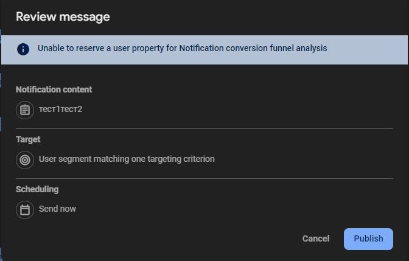

# Лабораторная работа №6. Уведомления. 

Цель работы: Изучить инструменты хранения данных, а также работу с внешними файлами. 

*Выполнила*: Иволгина Елизавета  
*Язык*: Dart

## Описание
Так как на языке Dart не осуществлена полноценная реализация уведомлений, напоминания создаются с помощью сайта https://console.firebase.google.com/u/0/project/flutternotificacio/messaging.  
В нем задается текст и содержание напоминания.  

<center></center>
Далее задется время, когда это сообщение будет доставлено на устройство.

<center></center>
Затем уведомление отправляется на устройство.

<center></center>
И приходит в заданный момент времени
<center></center>
При нажатии на уведомление происходит переход в приложение с созданными напоминаниями.
<center></center>

## Как работает?
### Список напоминаний 
На главном экране отображается список напоминаний. Если данных нет, выводится сообщение:
```
body: FutureBuilder<List<Reminder>>(
  future: reminders,
  builder: (context, snapshot) {
    if (!snapshot.hasData || snapshot.data!.isEmpty) {
      return Center(child: Text('Нет напоминаний'));
    }
    return ListView.builder(...);
  },
),

```
### Пуш-уведомления
Для обработки уведомлений используется ```FirebaseMessaging```.
```
FirebaseMessaging.onMessage.listen((RemoteMessage message) {
  _showLocalNotification(message);
});

Future<void> _showLocalNotification(RemoteMessage message) async {
  await _flutterLocalNotificationsPlugin.show(
    message.hashCode,
    message.notification?.title,
    message.notification?.body,
    NotificationDetails(...),
  );
}
```
### Удаление напоминаний
При нажатии на иконку корзины напоминание удаляется.
```
Future<void> _deleteReminder(BuildContext context, int id) async {
  await DatabaseHelper.instance.deleteReminder(id);
  _refreshReminders();
}
```
### Работа с БД
Напоминания хранятся в локальной базе данных SQLite с помощью класса ```DatabaseHelper```:
```
class Reminder {
  int? id;
  String title;
  String description;
  String date;
  
  // Преобразование объекта в Map для работы с базой
  Map<String, dynamic> toMap() {
    return {
      'id': id,
      'title': title,
      'description': description,
      'date': date,
    };
  }
}
```

****  

### Как собрать
* Установите Flutter SDK.
* Настройте Android studio: Установите плагины Flutter и Dart.
1. Загрузите репозиторий
2. Запустите Android Studio
3. Нажмите на "Open" и выберите папку с проектом
4. Выберите эмулятор(или подключите реальное устройство)
5. Нажмите "Run"